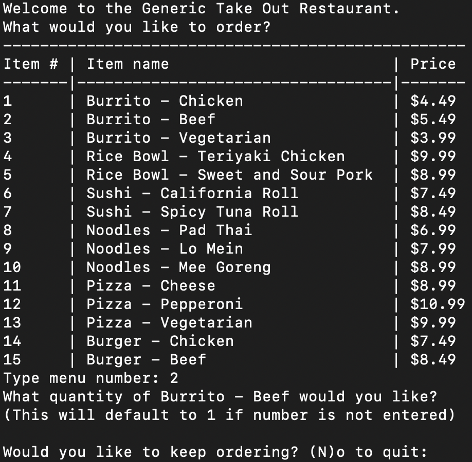

# ByteEats

## Description

ByteEats was designed to create an inclusive and efficient takeout ordering system for individuals with hearing and vocal impairments. The motivation behind this project was to improve accessibility in food service by allowing customers to place orders independently without verbal communication. This project places a huge emphasis on Python data structures and basics such as conditionals, loops, and handling user input.

## Table of Contents (Optional)

If your README is long, add a table of contents to make it easy for users to find what they need.

- [Installation](#installation)
- [Usage](#usage)
- [Credits](#credits)
- [License](#license)
- [Badges](#badges)
- [Features](#features)
- [Contribute](#how-to-contribute)
- [Tests](#tests)

## Installation

1. git clone https://github.com/HassanZafar-2021/ByteEats.git
2. cd ByteEats
3. Python3 order_system.py (if Python3 is installed)

## Usage

1. Run program
2. View menu
3. Place order
4. View Receipt

## Credits

No Collaborators

## License

No license

## Badges

## Features

✅ Text-Based Menu Display – Users can easily view categorized menu items with prices.

✅ Accessible Ordering System – Designed for customers with hearing and vocal impairments.

✅ Interactive Order Placement – Users can select items, specify quantity, and modify orders dynamically.

## How to Contribute

Clone Repo and make your own branch and push code to submit a PR request to contribute open-source.

## Tests

do the command npm run tests for testing and debugging purposes.
